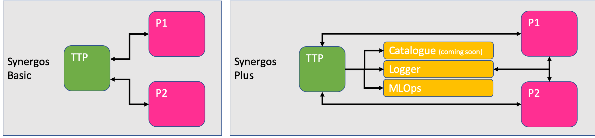
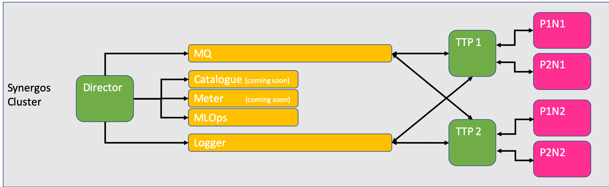

# Synergos TTP

Preliminary job orchestrator for a synergos cluster.


*Different grid configurations to suit your needs*

In federated learning, it is important to establish a secured grid, where all orchestrator(s) and participants can reside in, and communicate accordingly for complex federated workflows. However, this is often easier said than done, due to a multitude of deployment conditions & configurations to consider. That's where `Synergos` and its respective components come in. 

The ideas behind `Synergos` are simple: 
- MODULARITY - Plug-&-play methodology for assembling your ideal grid architecture
- AUTOMATION - All complexities involving federated orchestration are to be abstracted
- SIMPLICITY - Deploy & execute in a single command

TL;DR, We want users to be able to configure & deploy their federated endeavours with ease & confidence.

<br>

**Synergos TTP** is one of two core components essential for kickstarting your Synergos workflow!


*X-raying Synergos' core components*

Under the hood, we see that every feature embedded within each Synergos component is modularized as well. This allows users to activate or de-activate certain functionalities depending on their deployment setup.

Here's a quick breakdown of the various functions embedded within **Synergos TTP**:
- REST-RPC orchestration with [Synergos Worker](https://github.com/aimakerspace/synergos_worker.git)
- Federated algorithms library
- Artifact management
- Job scaling
- Centrialized logging
- Data cataloguing (coming soon!)
- Privacy metering (coming soon!)

For a deeper dive into the various methodologies implemented, feel free to peruse our [guide](https://docs.synergos.ai)!

> Note: Only the appointed **`ORCHESTRATOR`** needs to deploy **Synergos TTP** instance(s)

---
<br>

## Installation

Synergos TTP has been dockerized for easy component-based deployment.

```
# Download source repository
git clone https://github.com/aimakerspace/synergos_ttp.git
cd ./synergos_ttp

# Initialize & update all submodules
git submodule update --init --recursive
git submodule update --recursive --remote
```

As seen from the diagram above, there are 2 modes to Synergos TTP - *Basic* VS *Cluster*.

<br>

#### A. Deploying a Basic TTP

A basic Synergos TTP should be deployed when either a `Synergos Basic` grid or a `Synergos Plus` grid is desired. This is TTP at its purest form, without any bells and whistles for scaling workloads or job parallelizations. 

As such, these grids can only support sequential, singleton workloads, but have lesser compute dependencies.



*Basic **Synergos TTP** for `SynBasic` & `SynPlus` deployments*

To deploy this, execute the following instructions:

```
# Build basic TTP image
docker build -t synergos_ttp:synbasic --label "synbasic_ttp" . 

# Start containerized service
docker run --rm 
    -p <COMMAND PORT>:5000 
    -p <DATA PORT>:8020     
    -v <PATH-TO-DATA>:/orchestrator/data            # <-- Mount for data access
    -v <PATH-TO-OUTPUTS>:/orchestrator/outputs      # <-- Mount for outputs access
    -v <PATH-TO-MLFLOGS>:/mlflow                    # <-- Mount for MLFlow outputs
    --name ttp_synbasic 
    synergos_ttp:synbasic          
        --id ttp_synbasic        
        --logging_variant <LOGGER-VARIANT> <LOGGER-HOST> <SYSMETRIC-PORT> 
        --logging_resolution <LOGGING-RESOLUTION>   # <-- optional
        --cpus <CPU-COUNT>                          # <-- optional
        --gpus <GPU-COUNT>                          # <-- optional
        --censored                                  # <-- optional
        --debug                                     # <-- optional
```

- `<COMMAND PORT>` - Port on which REST-RPC service resides
- `<DATA PORT>` - Port on which intra-network TTP-WORKER communication occurs on
- `<PATH-TO-DATA>` - User's custom volume on which data is to be stored 
- `<PATH-TO-OUTPUTS>` - User's custom volume on which outputs are to be stored
- `<PATH-TO-MLFLOGS>` - User's custom volume on which MLFlow logs are to be stored
- `<LOGGER-VARIANT>` - Logger backend deployed (i.e. `"graylog"` or `"basic"`)
    - `<LOGGER-HOST>` - If Synergos Logger was deployed, specify logger's host
    - `<SYSMETRIC-PORT>` - If Synergos Logger was deployed, specify logger's allocated sysmetric port. A sysmetric port is the port allocated for logging system resource usage for any synergos component within the same deployment setting/grid.
- `<LOGGING-RESOLUTION>` - Interval for sysmetric logging (if Synergos logger is deployed)
- `<CPU_COUNT>` - Manual allocation of CPU cores to this TTP instance. If not specified, Synergos TTP auto scales to all compute in its host server. This option allows you to manage CPU allocation if you are deploying multiple components on the same machine.
- `<GPU_COUNT>` - Manual allocation of GPU cores to this TTP instance. If not specified, Synergos TTP auto scales to all DETECTABLE GPU cores in its host server. This option allows you to manage GPU allocation if you are deploying multiple components on the same machine.
- `--censored` - Omits key network identifiers from logs
- `--debug` - Launches container in debug mode (i.e. all debug messages logged)

An example of a *basic* launch command is as follows:

```
docker run --rm 
    -p 5001:5000   
    -P 8021:8020   
    -v /synergos_demos/orchestrator/data/:/director/data      
    -v /synergos_demos/orchestrator/outputs/:/director/outputs      
    -v /synergos_demos/orchestrator/mlflow/:/mlflow 
    --name ttp_synbasic 
    synergos_ttp:synbasic          
        --id ttp_synbasic        
        --logging_variant graylog 172.30.0.4 9300 
        --queue rabbitmq 172.17.0.4 5672
```

> Note: Only 1 **Synergos TTP** should be deployed in a `SynBasic` or `SynPlus` grid!


<br>

#### B. Deploying a Cluster TTP
A *cluster* **Synergos TTP** should be deployed a `Synergos Cluster` grid is desired. This is TTP equipped with features for scaling workloads and/or job parallelizations. 



*Cluster **Synergos TTP** for `SynCluster` deployments*

To deploy this, execute the following instructions:

```
# Build TTP Cluster image
docker build -t synergos_ttp:syncluster --label "syncluster_ttp" . 

# Start containerized service
docker run --rm 
    -p 5001:5000   
    -P 8021:8020     
    -v <PATH-TO-DATA>:/orchestrator/data            # <-- Mount for data access
    -v <PATH-TO-OUTPUTS>:/orchestrator/outputs      # <-- Mount for outputs access
    -v <PATH-TO-MLFLOGS>:/mlflow                    # <-- Mount for MLFlow outputs
    --name ttp_syncluster 
    synergos_ttp:syncluster          
        --id ttp_syncluster      
        --grid <GRID IDX>                           # <-- IMPT! 
        --queue <MQ-VARIANT> <MQ-HOST> <MQ-PORT>
        --logging_variant <LOGGER-VARIANT> <LOGGER-HOST> <SYSMETRIC-PORT> 
        --logging_resolution <LOGGING-RESOLUTION>   # <-- optional
        --cpus <CPU-COUNT>                          # <-- optional
        --gpus <GPU-COUNT>                          # <-- optional
        --censored                                  # <-- optional
        --debug                                     # <-- optional
```

In addition to *basic* configurations, users need to specify:
- `<GRID IDX>` - Mandatory declaration of grid index. This locks this Synergos TTP instance to a particular set of **Synergos Workers**, and prevents mis-triggers between sub-grids.
- `<MQ-VARIANT>` - Message queue backend deployed (only `"rabbitmq"` accepted for now)
    - `<MQ-HOST>` - Specify Synergos MQ's host. This is a mandatory declaration, since Synergos Director orchestratrates jobs across multiple grids.
    - `<MQ-PORT>` - Synergos MQ's allocated port

An example of a *cluster* launch command is as follows:

```
docker run --rm 
    -p 5001:5000   
    -P 8021:8020   
    -v /synergos_demos/orchestrator/data/:/director/data      
    -v /synergos_demos/orchestrator/outputs/:/director/outputs      
    -v /synergos_demos/orchestrator/mlflow/:/mlflow 
    --name ttp_syncluster_2 
    synergos_ttp:syncluster          
        --id ttp_syncluster_2  
        --grid 1
        --queue rabbitmq 172.17.0.4 5672      
        --logging_variant graylog 172.30.0.4 9300 

```

> Note: Multiple **Synergos TTP** instance can be deployed in a `SynCluster` grid!

---
<br>

## Further Resources

You can view the guides for running:
- [Synergos Basic Standalone Grid i.e. local](https://docs.synergos.ai/BasicRunLocal.html)
- [Synergos Basic Distributed Grid i.e. across multiple devices](https://docs.synergos.ai/BasicRunDistributed.html)
- [Synergos Cluster Distributed Grid i.e. across multiple devices](https://docs.synergos.ai/ClusterRunDistributed.html)
- [Example Datasets and Jupyter Notebooks](https://github.com/aimakerspace/Synergos/tree/master/examples)
